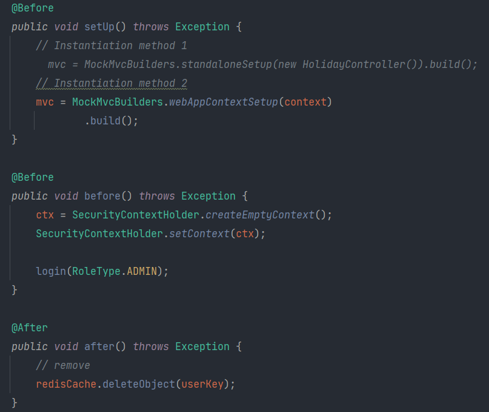

## 7.2 Existing work and software

In fact, the holiday application and management system has not received attention recently. Both China and the United States' top Internet companies, such as Google, Facebook, Amazon, Byte Dance, Alibaba, Tencent, and other companies, have their own internal office software.

In the software development life cycle that conforms to the Internet company's specifications, code testing is very important. It can show whether the code quality meets the specification requirements in many ways.

Taking use case testing as an example, many developers will use different tools to test the code in the iterative process according to the language type of the code, such as Java language. We can use tools such as JUnit, Jacoco, Maven Test to test code coverage or pass Whether the indicators such as the rate meet the requirements.

I will use Junit to analyze the test process in the next section.

## 7.3 Analysis

Before the analysis, we determine what the target needs to be tested is. Use case testing is not a simple test database access interface, but consists of white box testing and black box testing.

White box testing focuses on the internal implementation of the code, while black box testing focuses on the external structure of the program. Here, an example of the process of detecting code coverage by white box testing.

Junit is a very good existence among Java testing tools. In order to use it, we first need to integrate it into our framework (just write the dependency into pom.xml):

Then create the test file HolidayControllerTest corresponding to the controller (take HolidayController as an example): 

The function of the annotation on the class name is to use SpringBoot to specify the operating environment and specify the running order of the test method.

Here, I also need to explain some more abstract concepts. For example, Mock, which is preset by the developer, is used to simulate the object input by the user. The tool MockMvc also exists in SpringBoot, which can simulate the complete path request response required in white box testing. Therefore, we can use the above methods to implement a specific test process for us.

There are also some concepts about security that have to be mentioned, such as SecurityContext can be used to access security information from the context; AuthenticationManager and JWT are used in the program to implement the authentication function, but the implementation of this function is more complicated, I will use it Encapsulated in the login method.

Why talk about security? Because the test work of the program is based on the almost complete code development work, the authentication function of the back-end will greatly affect the test process, so we need to use AOP to weave the authentication information before the test method is executed before the test starts. as the picture shows:

The next step is the specific implementation of the test method. Let's take the CRUD as an example:

>**GET Request**
>
>1. mvc.perform executes a request.
>2. MockMvcRequestBuilders.get("XXX") constructs a request.
>3. Method header and Method requestAttr add authentication information
>4. Method param add request value
>5. Method accept(MediaType.TEXT_HTML_VALUE)) set the return type
>6. ResultActions.andExpect adds the assertion after the execution is complete.
>7. Add a result processor to ResultActions.andDo to indicate what to do with the result
>  For example, use MockMvcResultHandlers.print() to output the entire response result information here.
>8. ResultActions.andReturn means that the corresponding result will be returned after the execution is completed.
>

>**POST Request**
>
>1. mvc.perform executes a request.
>2. MockMvcRequestBuilders.post("XXX") constructs a request.
>3. Method header and Method requestAttr add authentication information
>4. Method param add request value
>5. Method accept(MediaType.TEXT_HTML_VALUE)) set the return type
>6. ResultActions.andExpect adds the assertion after the execution is complete.
>7. Add a result processor to ResultActions.andDo to indicate what to do with the result
>     For example, use MockMvcResultHandlers.print() to output the entire response result information here.
>8. ResultActions.andReturn means that the corresponding result will be returned after the execution is completed.

>**PUT Request**
>
>1. mvc.perform executes a request.
>2. MockMvcRequestBuilders.put("XXX") constructs a request.
>3. Method header and Method requestAttr add authentication information
>4. Method param add request value
>5. Method accept(MediaType.TEXT_HTML_VALUE)) set the return type
>6. ResultActions.andExpect adds the assertion after the execution is complete.
>7. Add a result processor to ResultActions.andDo to indicate what to do with the result
>     For example, use MockMvcResultHandlers.print() to output the entire response result information here.
>8. ResultActions.andReturn means that the corresponding result will be returned after the execution is completed.
>
>

>**DELETE Request**
>
>1. mvc.perform executes a request.
>2. MockMvcRequestBuilders.delete("XXX") constructs a request.
>3. Method header and Method requestAttr add authentication information
>4. Method param add request value
>5. Method accept(MediaType.TEXT_HTML_VALUE)) set the return type
>6. ResultActions.andExpect adds the assertion after the execution is complete.
>7. Add a result processor to ResultActions.andDo to indicate what to do with the result
>     For example, use MockMvcResultHandlers.print() to output the entire response result information here.
>8. ResultActions.andReturn means that the corresponding result will be returned after the execution is completed.

Run all test cases: 

Generate Junit coverage report: 

